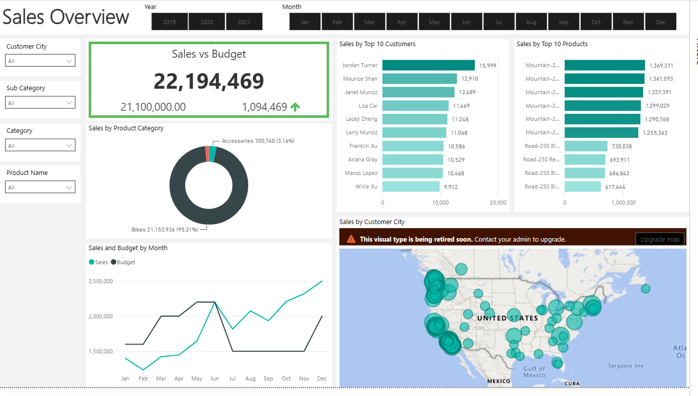
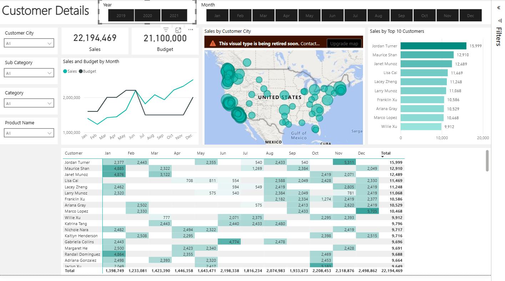
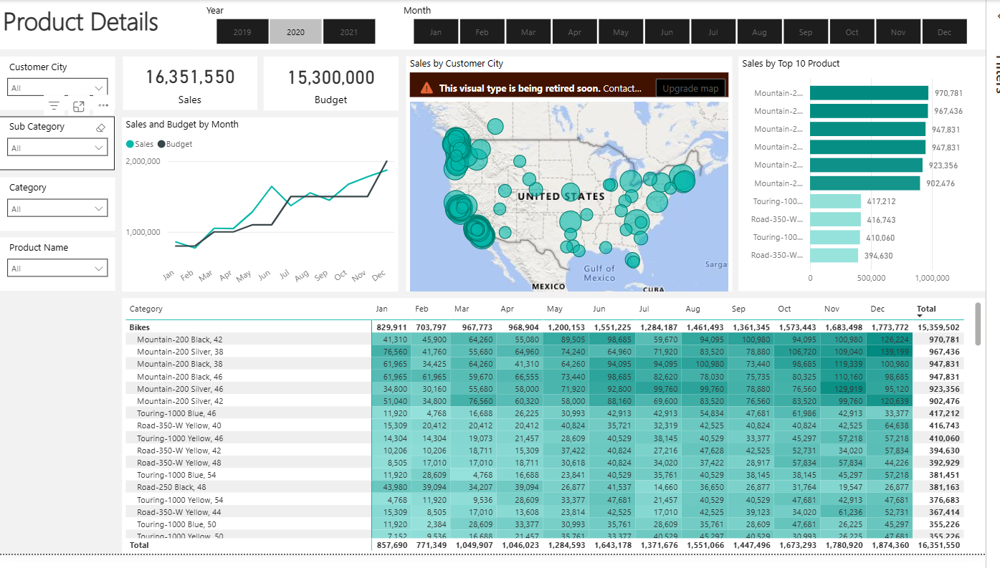

# Sales & Performance Analysis

A sales analytics and business intelligence project built using
**Microsoft SQL Server, Microsoft Power BI, and the Microsoft
AdventureWorks Data Warehouse**. The project transforms dimensional and
transactional data into structured analytical datasets and interactive
Power BI reports for monitoring sales performance, budget variance,
customer performance, product performance, and geographic trends.

## 📌 Project Overview

The objective is to develop an end-to-end sales reporting and
performance analysis solution that enables users to:

-   Monitor sales performance against budget
-   Analyze monthly sales and budget trends
-   Identify high-performing customers and products
-   Evaluate product category and sub-category performance
-   Analyze sales distribution by customer city
-   Drill down into customer- and product-level performance
-   Support data-driven business decisions

### Analytics Workflow

``` text
AdventureWorks Data Warehouse
            ↓
     SQL Extraction
            ↓
 Data Cleaning & Transformation
            ↓
 Analytical Tables
            ↓
      Power BI Data Model
            ↓
 Interactive Power BI Reports
            ↓
 Business Insights
```

## 🎯 Project Objectives

1.  Extract relevant data from the AdventureWorks Data Warehouse using
    SQL.
2.  Clean and transform customer, product, calendar, and internet-sales
    data.
3.  Create structured analytical tables for reporting.
4.  Build a dedicated calendar dimension for time-based analysis.
5.  Enrich customer records with geographic information.
6.  Enrich product records with category and sub-category information.
7.  Apply dynamic two-year filtering to transactional sales data.
8.  Connect the transformed SQL datasets to Power BI.
9.  Develop interactive KPI, trend, customer, product, and geographic
    analyses.
10. Compare actual sales against budget and identify performance trends.

## 🗂️ Dataset

This project uses the **Microsoft AdventureWorks Data Warehouse 2019**
dataset.

### Source Tables

**Dimension Tables** - `DimDate` - `DimCustomer` - `DimGeography` -
`DimProduct` - `DimProductSubcategory` - `DimProductCategory`

**Fact Table** - `FactInternetSales`

### Analytical Tables

The SQL transformations prepare four primary analytical datasets:

-   `Dim_Calendar`
-   `Dim_Customers`
-   `Dim_Products`
-   `Fact_Internet_Sales`

------------------------------------------------------------------------

# 🛠️ SQL Data Preparation

## 1. Dim_Calendar

The calendar table is created from `DimDate` and provides the fields
required for time-based reporting.

Selected fields include Date Key, Date, Day, Month, Month Short Name,
Month Number, Quarter, and Year.

The query filters calendar data to include records from **2019
onwards**.

``` sql
SELECT 
  [DateKey], 
  [FullDateAlternateKey] AS Date, 
  [EnglishDayNameOfWeek] AS Day, 
  [EnglishMonthName] AS Month, 
  LEFT([EnglishMonthName], 3) AS MonthShort,
  [MonthNumberOfYear] AS MonthNo, 
  [CalendarQuarter] AS Quarter, 
  [CalendarYear] AS Year
FROM [AdventureWorksDW2019].[dbo].[DimDate]
WHERE CalendarYear >= 2019;
```

## 2. Dim_Customers

Customer data is extracted from `DimCustomer` and enriched using a
`LEFT JOIN` with `DimGeography`.

Transformations include: - Renaming fields for reporting readability -
Creating a combined full-name field - Converting gender codes into
readable labels - Including the first purchase date - Adding customer
city through geographic mapping

``` sql
SELECT 
  c.customerkey AS CustomerKey, 
  c.firstname AS [First Name], 
  c.lastname AS [Last Name], 
  c.firstname + ' ' + lastname AS [Full Name],
  CASE 
    WHEN c.gender = 'M' THEN 'Male'
    WHEN c.gender = 'F' THEN 'Female'
  END AS Gender,
  c.datefirstpurchase AS DateFirstPurchase, 
  g.city AS [Customer City]
FROM [AdventureWorksDW2019].[dbo].[DimCustomer] AS c
LEFT JOIN dbo.DimGeography AS g 
  ON g.geographykey = c.geographykey
ORDER BY CustomerKey ASC;
```

## 3. Dim_Products

Product data is enriched by joining: - `DimProduct` -
`DimProductSubcategory` - `DimProductCategory`

Selected attributes include: - Product Key - Product Item Code - Product
Name - Sub Category - Product Category - Product Color - Product Size -
Product Line - Product Model Name - Product Description - Product Status

This structure enables hierarchical analysis from category →
sub-category → product.

## 4. Fact_Internet_Sales

The transactional dataset is extracted from `FactInternetSales`.

Selected fields include: - Product Key - Order Date Key - Due Date Key -
Ship Date Key - Customer Key - Sales Order Number - Sales Amount

A dynamic two-year filter is applied:

``` sql
WHERE LEFT(OrderDateKey, 4) >= YEAR(GETDATE()) - 2
```

This limits the extracted transaction data to the most recent two years
based on the current year.

------------------------------------------------------------------------

# 📊 Power BI Report

The Power BI report contains **3 analytical pages**:

1.  **Sales Overview**
2.  **Customer Details**
3.  **Product Details**

## 1️⃣ Sales Overview



The Sales Overview page provides an executive-level view of overall
sales performance.

### Sales vs Budget

  Metric                          Value
  ---------------------- --------------
  Sales                    **\$22.19M**
  Budget                   **\$21.10M**
  Favorable Variance        **\$1.09M**
  Favorable Variance %        **5.19%**

Actual sales exceeded the reported budget by **\$1.09M**, representing a
**5.19% favorable variance**.

### Sales by Product Category

**Bikes** are the dominant category: - **\$21.15M** sales - **95.31%**
of total sales

Accessories contribute: - **\$700.76K** - **3.16%** of total sales

### Sales by Top 10 Customers

The report ranks customers according to sales. The leading customer
shown is:

**Jordan Turner --- \$15,999**

The visual provides comparative performance for the remaining top
customers.

### Sales by Top 10 Products

The report ranks products according to sales contribution, allowing
high-performing products to be identified quickly.

### Sales and Budget by Month

A monthly trend compares actual sales against budget to identify: -
Monthly performance changes - Budget gaps - High-performing periods -
Changes in sales momentum

### Sales by Customer City

A geographic visualization displays the distribution of sales across
customer cities in the United States.

------------------------------------------------------------------------

# 2️⃣ Customer Details



The Customer Details page focuses on customer-level sales performance.

### Key Components

-   Total Sales
-   Total Budget
-   Sales and Budget by Month
-   Sales by Customer City
-   Top 10 Customers
-   Customer-by-month sales matrix

The customer matrix enables analysis of individual customer
contributions across months.

### Analysis Enabled

-   Identify high-value customers
-   Compare customer performance
-   Examine monthly purchasing patterns
-   Analyze geographic performance
-   Drill down to customer-level results

------------------------------------------------------------------------

# 3️⃣ Product Details



The Product Details page focuses on product-level performance.

### Key Components

-   Total Sales
-   Total Budget
-   Sales and Budget by Month
-   Sales by Customer City
-   Top 10 Products
-   Product-by-month sales matrix

The product matrix enables detailed analysis across individual products
and months.

### Analysis Enabled

-   Compare product performance
-   Identify top-performing products
-   Analyze monthly product trends
-   Compare category-level performance
-   Drill down to individual products

------------------------------------------------------------------------

# 🎛️ Interactive Filters

The Power BI report provides filters for:

-   **Year**
-   **Month**
-   **Customer City**
-   **Sub Category**
-   **Category**
-   **Product Name**

These filters allow users to dynamically explore performance across
time, geography, and product hierarchy.

------------------------------------------------------------------------

# 📈 Key Business Insights

### Overall Sales Performance

The report shows: - **\$22.19M** sales - **\$21.10M** budget -
**\$1.09M** favorable variance - **5.19%** favorable variance

### Product Category Performance

Bikes are the dominant contributor with **\$21.15M**, representing
**95.31%** of reported sales.

### Customer Performance

The Top 10 Customers analysis identifies the highest-value customers.
The leading customer shown is **Jordan Turner --- \$15,999**.

### Product Performance

The Top 10 Products visual highlights products with the highest reported
sales contribution.

### Geographic Performance

The Sales by Customer City visualization provides a geographic view of
sales distribution across customer locations in the United States.

------------------------------------------------------------------------

# 🧰 Technology Stack

### Database & Querying

-   Microsoft SQL Server
-   T-SQL
-   AdventureWorksDW2019

### Business Intelligence

-   Microsoft Power BI
-   Power BI Data Modeling
-   Interactive Visualizations
-   KPI Reporting

### Data Preparation

-   SQL Data Extraction
-   Data Cleaning
-   Data Transformation
-   SQL Joins
-   Calculated Fields
-   Date Dimension Preparation
-   Dynamic Date Filtering

------------------------------------------------------------------------

## 📂 Project Structure

``` text
sales-analytics-and-performance-dashboard/
│
├── README.md
├── data/
│   ├── dimCalender.csv
│   ├── dimCustomers.csv
│   ├── dimProducts.csv
│   └── fact_internet_sales.csv
├── sql/
│   ├── dim_calender.sql
│   ├── dim_customers.sql
│   ├── dim_products.sql
│   └── fact_internetsales.sql
```

e / Directory | Description |
|---|---|
| `README.md` | Project documentation and instructions |
| `data/` | Exported CSV datasets used for local development or Power BI imports |
| `sql/` | T-SQL scripts that prepare analytical tables (`Dim_Calendar`, `Dim_Customers`, `Dim_Products`, `Fact_Internet_Sales`) |

# 🚀 How to Reproduce

## Step 1 --- Set Up AdventureWorks

Install Microsoft SQL Server and restore/import the
**AdventureWorksDW2019** database.

## Step 2 --- Run SQL Transformations

Option A — If you have the AdventureWorksDW2019 database:

Open the T-SQL scripts in the `sql/` folder and execute them against
your AdventureWorksDW2019 database to create the analytical tables:

``` text
sql/dim_calender.sql
sql/dim_customers.sql
sql/dim_products.sql
sql/fact_internetsales.sql
```

Option B — If you don't have AdventureWorks and want to work locally:

Import the CSV files from the `data/` folder into Power BI or your
database and use them as the source for the report and analysis.

## Step 3 --- Open Power BI

Open the Power BI file:

``` text
sales-analytics-and-performance-dashboard.pbix
```

## Step 4 --- Connect to SQL Server

Connect Power BI to the SQL Server database containing the transformed
analytical tables.

## Step 5 --- Load and Refresh

Load the analytical tables into Power BI, establish the required
relationships, and refresh the data model.

## Step 6 --- Explore the Report

Navigate through:

``` text
Sales Overview
      ↓
Customer Details
      ↓
Product Details
```

Use the filters to analyze specific years, months, cities, categories,
sub-categories, and products.

------------------------------------------------------------------------

# 💡 Business Value

The project demonstrates how transactional and dimensional data can be
transformed into a structured business intelligence solution.

The resulting analysis supports: - Sales performance monitoring - Budget
variance analysis - Customer performance evaluation - Product
performance analysis - Geographic sales analysis - Monthly trend
analysis - KPI monitoring - Data-driven decision making

------------------------------------------------------------------------

# 📌 Project Highlights

  Metric                                  Value
  ---------------------------- ----------------
  Core analytical tables                  **4**
  Dynamic transaction filter        **2 years**
  Report pages                            **3**
  Reported Sales                   **\$22.19M**
  Reported Budget                  **\$21.10M**
  Favorable Variance                **\$1.09M**
  Favorable Variance %                **5.19%**
  Bikes Sales                      **\$21.15M**
  Bikes Sales Contribution           **95.31%**
  Analysis Period                **2019--2021**

------------------------------------------------------------------------

# 🧠 Skills Demonstrated

-   SQL / T-SQL
-   Data Extraction
-   Data Cleaning
-   Data Transformation
-   SQL Joins
-   Data Modeling
-   KPI Development
-   Sales Performance Analysis
-   Budget Variance Analysis
-   Customer Analysis
-   Product Analysis
-   Geographic Analysis
-   Microsoft Power BI
-   Business Intelligence
-   Interactive Reporting
-   Data-Driven Decision Making

------------------------------------------------------------------------

## 👤 Author

**Siba Narayana Parida**

Bachelor of Technology\
National Institute of Technology, Rourkela

------------------------------------------------------------------------

## ⭐ Project Summary

> An end-to-end SQL and Power BI sales performance solution that
> transforms AdventureWorks data into interactive KPI, customer,
> product, geographic, and budget analysis for data-driven business
> decision making.
